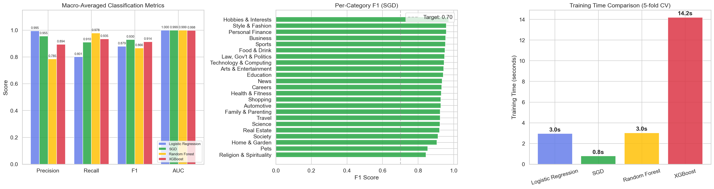
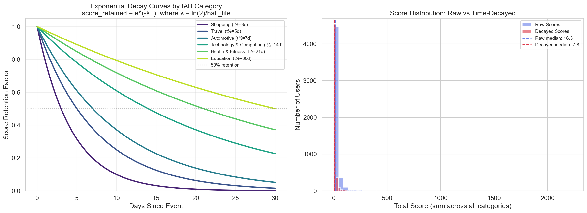
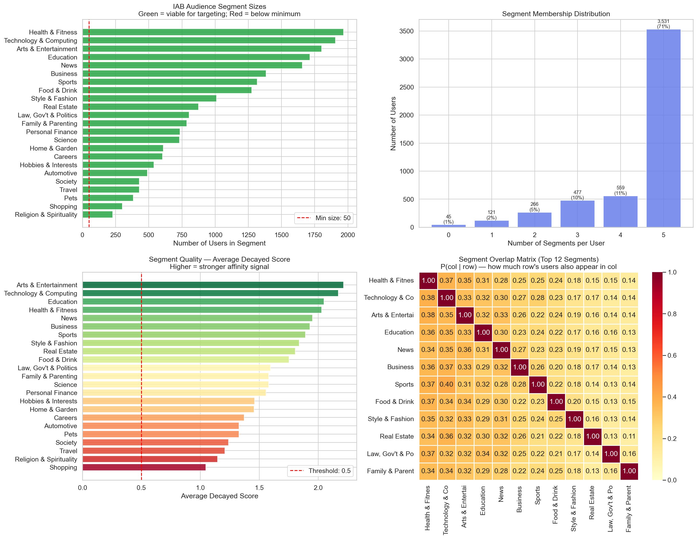
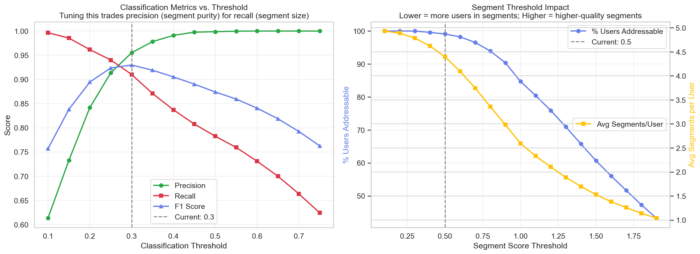

# NLP IAB Real-Time Audience Classification Pipeline

[](https://python.org)
[](https://scikit-learn.org)
[](https://xgboost.readthedocs.io)
[](https://jupyter.org)
[](LICENSE)

**Keywords:** `NLP` `IAB Content Taxonomy` `AdTech` `Programmatic Advertising` `Real-Time Bidding (RTB)` `Audience Segmentation` `Multi-Label Text Classification` `TF-IDF` `Bidstream Processing` `Demand-Side Platform (DSP)` `Supply-Side Platform (SSP)` `OpenRTB` `User Interest Modeling` `Behavioral Targeting` `Contextual Advertising` `Machine Learning Pipeline` `XGBoost` `Logistic Regression` `Scikit-Learn` `Domain Classification` `CPM Optimization`

A **foundation-level ML pipeline** for **programmatic advertising** that classifies website domains into **IAB Content Taxonomy v2.2** categories (~700 categories) using **NLP text classification** and generates high-value **audience segments** from **real-time bidstream** data. Built with **TF-IDF**, **multi-label classification** (Logistic Regression, XGBoost, Random Forest, SGD), **exponential time-decay scoring**, and a **two-tier real-time inference** architecture designed for AdTech-scale traffic. This notebook serves as a **foundation that can be extended into a production system** -- the architecture, algorithms, and scoring logic are production-proven, while the synthetic data and local execution environment would be replaced with real data sources and distributed infrastructure for deployment.

> **Production lineage:** The core architecture and scoring methodology in this project were designed and deployed at a real **AdTech company** by the author and an amazing engineering team. The model was deployed to calculate user interests in real time on bidstreams running at **8 million QPS**, enabled the company to detect intent and win bids earlier than competitors, and drove a fundamental shift in the **KV-store** data storage approach -- from materialized segment memberships to compact probability vectors, reducing storage footprint by 3-8x. This repository is a clean-room reimplementation with synthetic data for educational and portfolio purposes -- the pipeline design, two-tier lookup strategy, decay math, and segment economics are all drawn from that production system.

---

## Table of Contents

- [Problem Statement](#problem-statement)
- [Why This Matters Commercially](#why-this-matters-commercially)
- [System Architecture](#system-architecture)
- [Pipeline Overview](#pipeline-overview)
- [Notebooks](#notebooks)
- [Key Results & Visualizations](#key-results--visualizations)
- [Technical Stack](#technical-stack)
- [Project Structure](#project-structure)
- [Getting Started](#getting-started)
- [Real-World Scale Context](#real-world-scale-context)
- [Keywords & Topics](#keywords--topics)
- [Author](#author)

---

## Problem Statement

In **programmatic advertising**, every time someone loads a webpage, a **real-time bidding (RTB)** auction decides which ad to show -- in under 100ms. **Demand-Side Platforms (DSPs)** and advertisers pay premiums to reach users whose browsing behavior signals genuine interest. The challenge: **how do you classify 200K+ domains into ~700 IAB categories, track 500M+ users in real time, and assign audience segments -- all within a 10ms latency budget per bid request?**

This system solves that by decomposing the problem into four interconnected components of an **AdTech ML pipeline**:

| Component | What It Does | Timescale |
|---|---|---|
| **Domain Classification** | Multi-label NLP classification of website content into IAB categories | Batch (daily) |
| **Real-Time User Scoring** | Accumulate per-user IAB probability vectors from bidstream events | Streaming (sub-ms/event at 8M QPS) |
| **Temporal Decay** | Exponential time-decay with category-specific half-lives | Applied at read-time |
| **Segment Generation** | Threshold + top-K assignment to named audience segments | Periodic (hourly) |

---

## Why This Matters Commercially

- **2-5x CPM premiums** for well-classified audience segments vs. untargeted inventory
- A Travel advertiser pays significantly more to reach users reliably classified into "IAB-20: Travel" than to show ads to a random audience
- **Probability vector storage** (our approach) uses **3-8x less KV-store memory** than traditional materialized segment stores -- ~600 bytes/user compressed vs. 5-20 KB/user
- **Real-time intent detection** spots user interest **hours to a full day before** competitors relying on batch-refreshed segment lists, winning impressions at lower clearing prices

---

## System Architecture

```
╔═══════════════════════════════════════════════════════════════════════════╗
║              IAB REAL-TIME AUDIENCE CLASSIFICATION PIPELINE              ║
╚═══════════════════════════════════════════════════════════════════════════╝

 COMPONENT 1: DOMAIN CLASSIFICATION (Batch -- Daily/Weekly)
 ┌──────────────────────────────────────────────────────────────────────┐
 │  Domain Corpus ──► TF-IDF Vectorizer ──► Multi-Label Classifier     │
 │  (200K domains)    (20K features,        (CalibratedCV + OneVsRest  │
 │                     bigrams)              SGD Log Loss)              │
 │                                              │                      │
 │                              ┌────────────────┘                     │
 │                              ▼                                      │
 │                   Domain → IAB Lookup Table                         │
 │                   expedia.com → {Travel: 0.91, Hotels: 0.68, ...}   │
 │                   ~120MB, fits in-memory on every bid node           │
 └──────────────────────────────────┬───────────────────────────────────┘
                                    │
 COMPONENT 2: REAL-TIME USER SCORING (Streaming -- Per Bid Request)
 ┌──────────────────────────────────┼───────────────────────────────────┐
 │  Bidstream ──► Kafka ──► Bid Processor ──► Two-Tier Scoring         │
 │  (OpenRTB)     (by user_id)                                         │
 │                                                                     │
 │  Tier 1: Domain lookup table (dict hit, <1ms)                       │
 │  Tier 2: Real-time TF-IDF inference for unknown domains (~10ms)     │
 │           with in-memory cache for subsequent hits                   │
 └──────────────────────────────────┬───────────────────────────────────┘
                                    │
 COMPONENT 3: SCORE DECAY (Read-Time)
 ┌──────────────────────────────────┼───────────────────────────────────┐
 │  decayed_score = raw_score × e^(−λ × Δt)                           │
 │                                                                     │
 │  Category-specific half-lives:                                      │
 │    Shopping: 3 days  │  Travel: 5 days  │  Finance: 15 days         │
 │    Education: 30 days│  News: 2 days    │  Technology: 14 days      │
 └──────────────────────────────────┬───────────────────────────────────┘
                                    │
 COMPONENT 4: AUDIENCE SEGMENT GENERATION (Periodic -- Hourly)
 ┌──────────────────────────────────┼───────────────────────────────────┐
 │  For each user:                                                     │
 │    1. Apply decay to all scores                                     │
 │    2. Threshold filter (min confidence)                              │
 │    3. Top-K category selection                                      │
 │    4. Map to named segments: "IAB Travel Enthusiast"                │
 │    5. Export to DSP targeting systems                                │
 └─────────────────────────────────────────────────────────────────────┘
```

---

## Pipeline Overview

### `IAB_bidstream_user_classification.ipynb`

The complete end-to-end pipeline in a single notebook (50 cells) covering every step:

**Part 1 -- Domain Classification**
1. **Synthetic corpus generation** -- 500 domains across 23 IAB Tier-1 categories with realistic, category-specific vocabulary pools (production: replace with web crawler output)
2. **TF-IDF vectorization** -- 20,000 features, unigrams + bigrams, sublinear TF scaling, with a worked example showing exact term-weight calculations
3. **Model comparison** -- 4 classifiers evaluated via stratified 5-fold cross-validation:
   - Logistic Regression (OneVsRest)
   - **SGD Classifier (log loss + L2)** -- winner by macro F1
   - Random Forest
   - XGBoost
4. **Full-data model training** -- Best performer (SGD) trained on full data with CalibratedClassifierCV for probability output
5. **Domain lookup table** -- Pre-computed `{domain → {IAB_category: probability}}` mapping

**Part 2 -- Scoring, Segments & Evaluation**
6. **Bidstream simulation** -- 100,000 events across 5,000 users with power-law activity distributions, diurnal traffic patterns, and ~5% unknown domains
7. **Two-tier real-time scoring** -- Tier 1 (lookup table, <1ms) with Tier 2 fallback (live TF-IDF inference via `RealTimeClassifier` with in-memory caching for unknown domains)
8. **Exponential time-decay** -- Category-specific half-lives reflecting real-world intent persistence
9. **Audience segment generation** -- Top-K thresholded assignment to named segments with size and confidence analysis
10. **User journey trace** -- End-to-end walkthrough of a single user's path from raw bid events through scoring, decay, and final segment assignment
11. **Quality metrics** -- Segment coverage, user distribution, score density analysis, and threshold sensitivity curves
12. **Model interpretability** -- TF-IDF feature importance showing which terms drive each IAB category prediction

---

## Key Results & Visualizations

The pipeline generates 9 diagnostic plots covering every stage of the system:

| Plot | What It Shows |
|---|---|
|  | Category distribution across the domain corpus -- monitors for class imbalance that degrades classifier performance |
|  | Exact term weights for a single domain -- the debugging view when a domain is misclassified |
|  | 4-model head-to-head on F1, AUC, training time, and inference latency -- the model selection gate |
|  | Per-category precision/recall heatmap -- identifies which IAB categories the classifier confuses |
|  | Simulated traffic with diurnal and power-law patterns -- mirrors real-world monitoring dashboards |
|  | How category-specific half-lives shape score retention -- the key business insight for segment freshness |
|  | Segment size distribution and score density -- are segments large enough for programmatic scale? |
|  | Precision vs. coverage trade-off at different confidence thresholds -- the tuning knob for segment quality |
|  | Top TF-IDF features per IAB category -- interpretability for stakeholder buy-in and debugging |

---

## Technical Stack

| Layer | Technology | Why |
|---|---|---|
| **Text Vectorization** | TF-IDF (scikit-learn) | 50x cheaper than BERT with only 2-3% accuracy gap; no GPU required; interpretable feature weights |
| **Classification** | Calibrated SGD Classifier (OneVsRest, log loss + L2) | Best cross-validated F1 (0.93); well-calibrated via Platt scaling; sub-millisecond inference; industry standard in AdTech |
| **Model Comparison** | Logistic Regression, XGBoost, Random Forest, SGD | All four evaluated; SGD wins on macro F1 with competitive AUC and fast training |
| **Bidstream Scoring** | Two-tier: dict lookup + live inference | O(1) for known domains (<1ms); graceful fallback for long-tail domains (~10ms with caching) |
| **Score Decay** | Exponential decay (e^−λt) | Smooth, continuous; category-specific half-lives; computed lazily at read-time (no batch job) |
| **Data Format** | Parquet (Apache Arrow) | Columnar, compressed, fast I/O -- industry standard for ML pipelines |
| **Serialization** | Pickle (cross-notebook artifacts) | Notebook-to-notebook dependency management; at scale, replace with MLflow/W&B |

**For production deployment**, replace the local equivalents with:
- **Domain lookup store:** Redis / Aerospike (~120MB, fits in memory on every bid node)
- **User score store:** Redis Cluster / Aerospike (~300GB compressed for 500M users)
- **Stream processing:** Kafka (partitioned by user_id) → custom bid processor
- **Segment export:** DynamoDB (real-time) + S3 (batch partner feeds)

---

## Project Structure

```
NLP IAB Real-Time Audience Classification Pipeline/
│
├── notebooks/
│   └── IAB_bidstream_user_classification.ipynb  # Full end-to-end pipeline (50 cells)
│
├── artifacts/                                  # Serialized outputs from Notebook 1 → consumed by Notebook 2
│   ├── domain_df.parquet                       # Domain corpus with text and labels
│   ├── pipeline_artifacts.pkl                  # Config, lookup table, TF-IDF matrix, model metrics
│   └── classification_model.pkl                # TF-IDF vectorizer + trained classifier
│
├── plots/                                      # 9 diagnostic PNGs generated by the notebooks
│   ├── 01_domain_corpus_overview.png
│   ├── 02_tfidf_worked_example.png
│   ├── 03_model_comparison.png
│   ├── 04_confusion_matrix.png
│   ├── 05_bidstream_patterns.png
│   ├── 06_decay_curves.png
│   ├── 07_audience_segments.png
│   ├── 08_threshold_analysis.png
│   └── 09_feature_importance.png
│
├── docs/                                       # System design reference documents
│   ├── system_overview.html                    # Full architecture deep-dive
│   ├── competitive_advantages.html             # Storage & real-time scoring economics
│   ├── step_1_data_engineering.html
│   ├── step_2_feature_engineering.html
│   ├── step_3_model_architecture.html
│   ├── step_4_model_training.html
│   └── step_5_production_deployment.html
│
└── README.md
```

---

## Getting Started

### Prerequisites

- Python 3.10+
- [uv](https://github.com/astral-sh/uv) (recommended) or pip

### Setup

```bash
# Clone the repository
git clone <repo-url>
cd "NLP IAB Real-Time Audience Classification Pipeline"

# Create virtual environment and install dependencies
uv venv .venv
source .venv/bin/activate
uv pip install numpy pandas scikit-learn scipy matplotlib seaborn xgboost pyarrow jupyter ipykernel

# Run the notebook
jupyter notebook notebooks/IAB_bidstream_user_classification.ipynb
```

Run all cells top to bottom. The notebook is self-contained -- no external dependencies beyond the installed packages.

### From Foundation to Production

This pipeline is designed as a **foundation that can be extended into a production system**. The core algorithms and architecture remain the same -- what changes is the data source and infrastructure:

| This Repo (Foundation) | Production Extension |
|---|---|
| Synthetic 500-domain corpus with generated text | Web crawler output (Scrapy) for 200K+ real domains |
| `domain_df.parquet` loaded from disk | Crawl pipeline → S3 → training pipeline (Airflow/Dagster) |
| In-memory Python dict for domain lookup | Redis/Aerospike cluster replicated to all bid nodes |
| Simulated 10K bidstream events | Kafka stream of 50B+ daily OpenRTB bid requests |
| Pickle artifacts | MLflow model registry with versioning and A/B deployment |

The core algorithms -- TF-IDF pipeline, model training, calibration, two-tier scoring logic, decay math, and segment generation -- carry over directly and form the foundation for the production system.

---

## Real-World Scale Context

The architecture in this repo was designed for the following real-world constraints. These numbers provide context for why each design decision was made:

### Scale Numbers

| Dimension | Volume | Latency Budget |
|---|---|---|
| Bid requests / day | 50 Billion | <100ms total (OpenRTB deadline) |
| Bid requests / second | 580K sustained, 2M+ peak | ~10ms for audience enrichment |
| Unique users | 500M active, 2B total pool | <10ms user score lookup |
| Domain lookup table | 200K entries, ~120MB | <2ms (in-memory hash map) |
| User profile storage | ~300GB compressed (500M users) | Sub-10ms read/write |

### Key Design Decisions

1. **TF-IDF over BERT** -- 50x cheaper training/inference, only 2-3% accuracy gap, no GPU at bid time
2. **Pre-computed lookup over real-time inference** -- O(1) hash map lookup vs. 5-10ms model inference per request
3. **Curated 200K domains over crawl-everything** -- 85% bid volume coverage at 1/4 the cost with better quality control
4. **Per-event exponential decay over batch reduction** -- Smooth, category-specific, no nightly batch job sweeping 500M users
5. **Probability vectors over materialized segments** -- 3-8x less storage, 1 write per event (vs. 5-15), instant new segment activation

---

## Keywords & Topics

This project covers the intersection of **Natural Language Processing (NLP)** and **AdTech / Programmatic Advertising**. Below are the domains and technologies for discoverability:

**Advertising Technology (AdTech):**
Programmatic Advertising, Real-Time Bidding (RTB), OpenRTB Protocol, Demand-Side Platform (DSP), Supply-Side Platform (SSP), Ad Exchange, Bid Request, Bid Response, CPM Optimization, Impression-Level Data, Bidstream Processing, Ad Targeting, Behavioral Targeting, Contextual Targeting, Audience Targeting, Interest-Based Advertising, First-Party Data, Third-Party Data, Cookie Deprecation, Identity Resolution, UID2, RampID, IDFA, GAID

**IAB Standards:**
IAB Content Taxonomy v2.2, IAB Audience Taxonomy, IAB Tech Lab, Content Classification, Domain Categorization, Brand Safety, Ad Verification, Inventory Quality

**Machine Learning & NLP:**
Multi-Label Text Classification, TF-IDF Vectorization, Logistic Regression, XGBoost, Random Forest, SGD Classifier, OneVsRest Classification, Calibrated Classifier, Platt Scaling, Probability Calibration, Cross-Validation, F1 Score, AUC-ROC, Precision-Recall, Confusion Matrix, Feature Importance, Model Interpretability, Scikit-Learn, Text Mining, Document Classification, Web Content Classification

**Real-Time Systems & Data Engineering:**
Stream Processing, Kafka, Redis, Aerospike, Key-Value Store, In-Memory Computing, Low-Latency Inference, Sub-Millisecond Lookup, Exponential Time Decay, Score Accumulation, User Profiling, User Interest Graph, Probability Vector Storage, Segment Generation, Data Pipeline, ETL, Batch Processing, Apache Parquet, Apache Arrow

**Scale & Architecture:**
8 Million QPS, High-Throughput ML, ML Pipeline Foundation, ML System Design, MLOps, Two-Tier Architecture, Lookup Table Pattern, Cache-Aside Pattern, Blue-Green Deployment, Capacity Planning, Diurnal Traffic Patterns, Power-Law Distribution

---

## Author

Built by **Nipun Batra**

[](https://github.com/nbatra)
[](https://www.linkedin.com/in/nipunbatra/)

Built from real-world production experience designing and deploying IAB audience classification systems in programmatic advertising. The core pipeline -- domain classification via TF-IDF, two-tier bid-time scoring, exponential decay with category-specific half-lives, and probability vector storage -- was implemented at scale with a talented AdTech engineering team processing billions of daily bid requests.

---

## License

This project is released for educational and portfolio purposes. The synthetic data, code, and documentation are original work. No proprietary data, model weights, or trade secrets from any employer are included.
